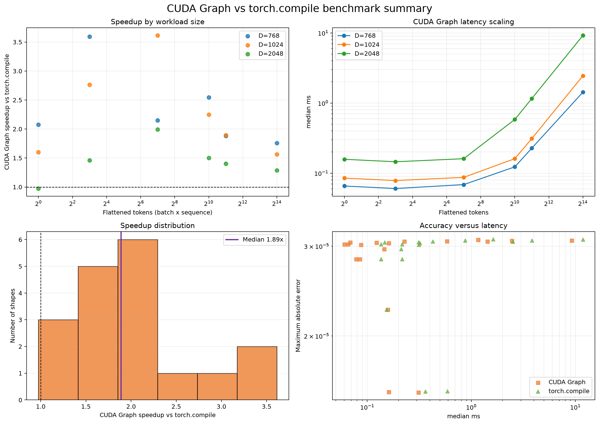
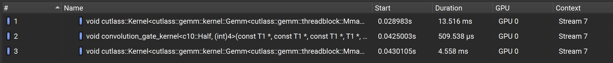

# Convolution Gate Kernel

This repo contains a CUDA kernel for Convolution Gates that might be found in models such as Liquid AI's LFM 2.5. The Convolution Gate in this repo works by running across each channel of the model's dimension for a sequence of token embeddings. I utilized CUTLASS for the matrix multiplication steps in the 2 linear layers and created a kernel for the convolution itself.

The custom CUDA kernel and CUDA graph outperforms PyTorch eager and varies in performance relative to Torch.compile depending on workload.

### Why
My motivation for building this was to learn more about the process of creating performant kernels for AI architectures that efficiently utilize hardware. When building out this repo I learned about the architecture I was implementing and decomposed it into various sub operations (matmul, dot product, element multiplication).
I also profiled the kernel in order to optimize parts of the operation (ex. removing a separate add bias kernel that was contributing latency).

### Process
I used AI to research the architecture of gated convolutions used in LFM which allowed me to decompose the underlying math ops. I decided to use CUTLASS for the 2 matmuls in the 2 linear layers due to it being highly optimized and likely better than what I could come up with.
The kernel itself computes the convolution between token wise channels and gates the results. Memory is accessed via striding, allowing a single contiguous section of memory to be used as b_gate, c_gate, and x_tilde.

### Findings
The largest bottleneck for the combined kernels is memory bandwidth (particularly for the 2 matmuls). With increased batch size / sequence size this becomes more manageable and results in the kernel becoming more performant than PyTorch eager. Validation was conducted via comparison with PyTorch implementation, errors fell within expected floating point bounds.
I expect that the kernel is faster than eager implementation due to benefits of compilation and the fused convolution allowing more efficient memory movement. 

*Speedups most noticeable as total tokens increase*

The kernel is similar to Torch compile likely due to the matmuls taking up the majority of runtime and being harder to optimize. The kernel shows significant performance gain relative to Torch compile in midsized token sequences (2^3 to 2^10 tokens) with speedup dropping off in both directions.

Config: B=4, T=1024, D=2048, K=4, dtype=float16
     pytorch_eager: mean=   3.016 ms  median=   2.955 ms  std= 0.076 ms  throughput=  331.62 iter/s
       cuda_kernel: mean=   2.301 ms  median=   2.301 ms  std= 0.004 ms  throughput=  434.65 iter/s
        cuda_graph: mean=   2.284 ms  median=   2.284 ms  std= 0.001 ms  throughput=  437.73 iter/s
     torch.compile: mean=   2.488 ms  median=   2.486 ms  std= 0.010 ms  throughput=  401.99 iter/s

Config: B=8, T=2048, D=2048, K=4, dtype=float16
     pytorch_eager: mean=  11.089 ms  median=  11.063 ms  std= 0.082 ms  throughput=   90.18 iter/s
       cuda_kernel: mean=   9.290 ms  median=   9.309 ms  std= 0.083 ms  throughput=  107.64 iter/s
        cuda_graph: mean=   9.292 ms  median=   9.299 ms  std= 0.065 ms  throughput=  107.62 iter/s
     torch.compile: mean=   9.294 ms  median=   9.294 ms  std= 0.013 ms  throughput=  107.60 iter/s

Config: B=4, T=4096, D=2048, K=4, dtype=float16
     pytorch_eager: mean=  11.086 ms  median=  11.078 ms  std= 0.062 ms  throughput=   90.20 iter/s
       cuda_kernel: mean=   9.280 ms  median=   9.240 ms  std= 0.066 ms  throughput=  107.75 iter/s
        cuda_graph: mean=   9.287 ms  median=   9.297 ms  std= 0.064 ms  throughput=  107.68 iter/s
     torch.compile: mean=   9.245 ms  median=   9.244 ms  std= 0.005 ms  throughput=  108.17 iter/s

*Nsight Compute profile shows the 2 CUTLASS kernels taking up the vast majority of runtime*
### AI Usage (Antigravity Gemini 3.7, Cursor Composer 2.5, M365 Copilot)
I used AI to research the convolution gate architecture, enabling me to make better design choices. Once I could distinguish the parts I needed to implement, I specified the structure of the kernel and used Antigravity / Cursor for implementation.
